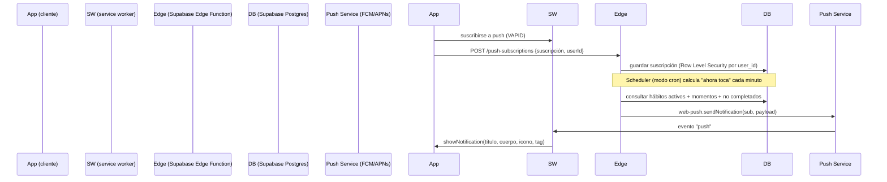

# Opción A — Web Push con Supabase Edge Functions

Objetivo: recibir recordatorios de hábitos **con la PWA cerrada** en iOS y Android,
usando el estándar Web Push (sin notificaciones locales ni recarga de la app).

Estado: PLAN — sin implementar. Arquitectura elegida y pasos listos para ejecutar.

---

## Decisión

| Alternativa            | ¿Cierra? | Coste        | Mantenimiento |
|------------------------|----------|--------------|---------------|
| **A) Web Push + Edge** ✅ | Sí       | Backend + push | Servidor de scheduling |
| B) Notificaciones locales | No       | —            | —             |
| C) FCM nativo          | Solo Android | Medio    | 2 SDKs (Google y Apple) |

Se elige **A**: reutiliza el `sw.js` que ya existe, funciona en ambas plataformas con un
único backend, y aprovecha Supabase que ya está integrado (auth, habits, completions).

---

## Arquitectura propuesta



---

## Fases de implementación

### Fase 1 — Claves VAPID y configuración
1. Generar par de claves VAPID (público + privado):
   ```bash
   npx web-push generate-vapid-keys
   ```
2. Guardar en variables de entorno:
   - `NEXT_PUBLIC_VAPID_PUBLIC_KEY` (cliente)
   - `VAPID_PRIVATE_KEY` **solo servidor** (nunca en cliente)
   - `VAPID_SUBJECT` → `mailto:admin@tudominio.com`
3. Instalar en las Edge Functions: `web-push` (o `@supabase/edge-runtime` con `WebPush`).

> **Seguridad**: la clave privada VAPID jamás debe ir a `NEXT_PUBLIC_*` ni a
> variables expuestas al navegador. Solo la pública vive en el cliente.

### Fase 2 — Suscripción en cliente
En `lib/notifications.ts` (junto a `prepararNotificaciones`):

```ts
async function suscribirsePush(registration: ServiceWorkerRegistration) {
  const publicKey = process.env.NEXT_PUBLIC_VAPID_PUBLIC_KEY;
  if (!publicKey) throw new Error("Falta la clave pública VAPID");
  const key = urlB64ToUint8Array(publicKey);
  return (await registration.pushManager.subscribe({
    userVisibleOnly: true,
    applicationServerKey: key,
  })).toJSON();
}
```
- Llamar al guardar (Fase 3) y guardar también en `localStorage` para recalcular
  el estado de activación.
- Manejar `NotAllowedError` (permiso denegado) y `InvalidStateError` (ya suscrita).

### Fase 3 — Guardar suscripción (Edge Function)
Nueva Edge Function `push-subscriptions`:
- `POST` con `{ subscription, userId }`.
- Validar que `userId` de la sesión JWT (Supabase Auth) coincida con el cuerpo (RLS).
- `INSERT ... ON CONFLICT (user_id) DO UPDATE` (una suscripción por usuario).

Esquema SQL (migración):
```sql
create table push_subscriptions (
  id uuid primary key default gen_random_uuid(),
  user_id uuid not null references auth.users on delete cascade,
  endpoint text not null,
  keys jsonb not null,
  created_at timestamptz not null default now(),
  unique (user_id)
);
alter table push_subscriptions enable row level security;
create policy "usuario gestiona su suscripción"
  on push_subscriptions for all
  using (auth.uid() = user_id);
```

### Fase 4 — Scheduler (cálculo de "ahora toca")
- Añadir Edge Function como **scheduled job** (Supabase: `pg_cron` o `vercel.json`/cron
  en el host elegido), ejecución **cada minuto**.
- Por minuto `HH:mm`, consultar:
  1. Hábitos activos con algún `moment` de tipo `hora` e `hora === HH:mm`.
  2. Día actual dentro de `habit.dias`.
  3. Fuera de `settings.horasDescanso` (reloj: salvo si ha pasado medianoche → solo matutinas).
  4. `moment` no completado hoy (JOIN con `completions` por `event_id`).
- Para `ventana` (flexible): decidir política. P. ej. solo notificar a una hora
  representativa (`manana=09:00`, `tarde=14:00`, `noche=20:00`) hasta que se complete.
- Excluir hábitos ya completados hoy para no molestar.

### Fase 5 — Envío push
- `web-push.sendNotification(subscription, JSON.stringify(payload))`.
- Payload: `{ title, body, data: { habitId, momentId, url } }` (máx. ~4 KB).
- **Dedupe/idempotencia**: mantener en DB `push_log` con `event_id` y `minute` para no
  reenviar el mismo recordatorio si el scheduler corre dos veces o el móvil reconecta.
- Preservar la lógica ya existente en cliente (tag por minuto) como red de seguridad
  para no duplicar cuando la app está abierta.

### Fase 6 — Receptor en el service worker
En `public/sw.js` (ya existe, añadir):
```js
self.addEventListener("push", (event) => {
  const data = event.data?.json() ?? {};
  event.waitUntil(self.registration.showNotification(data.title, {
    body: data.body,
    icon: "/icon.svg",
    badge: "/icon.svg",
    tag: `habito-${data.data.habitId}-${data.data.momentId}-${new Date().toISOString().slice(0, 16)}`,
    data: data.data,
    vibrate: [120, 80, 120],
  }));
});
```
- `notificationclick` ya implementado (cierra y enfoca/abre la app). Ajustar `url`.
- `showNotification` → garantiza "user visible" (requisito de los navegadores).

### Fase 7 — UI y configuración en Ajustes
- Botón "Activar notificaciones" que pide permiso **dentro de un gesto del usuario**
  (ya se hace así), y que ahora además suscribe a push.
- Añadir indicador de estado: `granted` / `denied` / `subscription existente`.
- Texto claro de las limitaciones por plataforma (ver abajo).
- En iOS: pedir "Añadir a pantalla de inicio" antes de suscribir (es requisito para que
  el service worker y las notificaciones funcionen).

### Fase 8 — Pruebas
- Servidor local de push (`npx web-push send-notification`) para depurar el payload.
- Device farm manual: Android Chrome, iPhone Safari (PWA instalada), escritorio.
- Verificar `push_log` para confirmar dedupe.

---

## Limitaciones por plataforma (comunicar al usuario en la UI)

| Plataforma            | Estado |
|----------------------|--------|
| Android (Chrome)      | ✅ Push funciona con la app cerrada |
| iOS Safari 16.4+      | ✅ Push funciona SOLO si está instalada en pantalla de inicio |
| iOS Safari < 16.4      | ❌ Sin push; caer a notificación local |
| Escritorio (Chrome/FF) | ✅ Push funciona cerrado (si el navegador está abierto) |

**Nota iOS**: el usuario debe haber "Añadido a pantalla de inicio" y aceptar el permiso
desde ahí. Sin esto, `pushManager.subscribe` lanzará `NotAllowedError`.

---

## Riesgos y mitigaciones
- **Caducidad del token de suscripción**: manejar el error `expired` en `push` y
  borrar la fila de `push_subscriptions`.
- **Costo del scheduler por minuto**: aceptable a escala pequeña (unos 43k invocaciones/mes
  por usuario→ en realidad una sola función compartida, no por usuario).
- **RLS**: toda consulta en Edge Function usa JWT; nunca confiar en campos del cliente.
- **Rayos de la app abierta vs push**: la comprobación local existente y el `tag` en
  `showNotification` evitan duplicados visuales.

---

## Dependencias nuevas
- `web-push` en las Edge Functions (deno/puntas), no en el cliente.
- Sin SDK de navegador extra: se usa la API estándar `PushManager`.
- Almacén: tabla `push_subscriptions` + tabla `push_log`.
